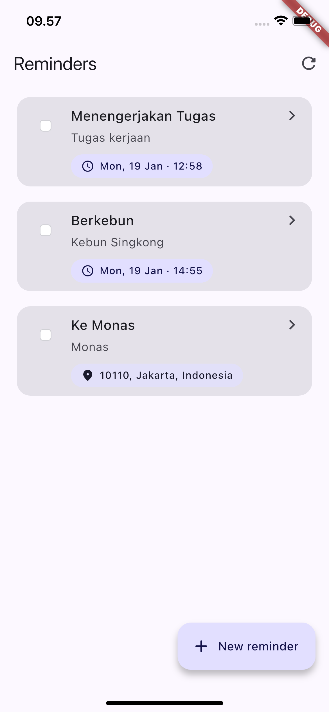
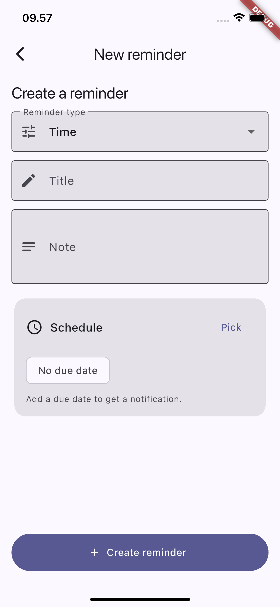
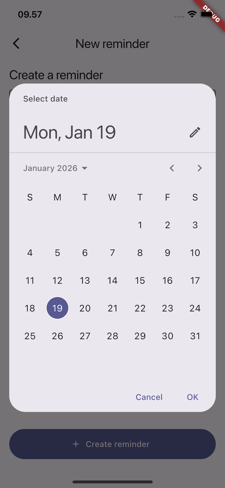
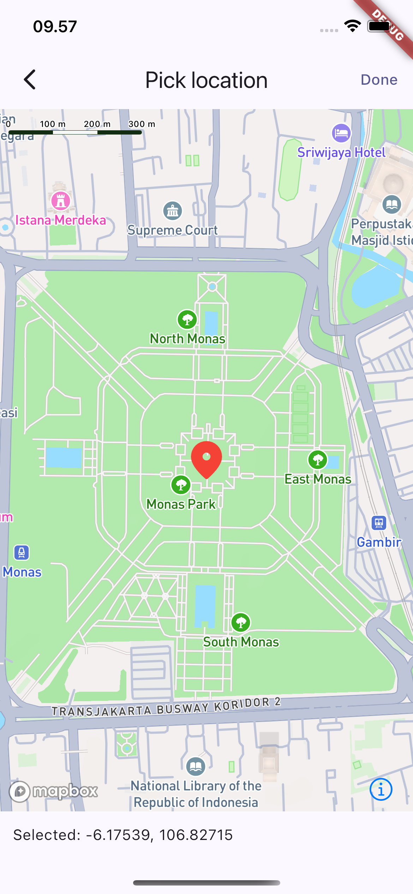

# Reminder

A Flutter app to create and manage reminders.

This project supports two reminder types:

- **Time reminders**: schedule a local notification at a selected date/time.
- **Location reminders**: receive a local notification when you are within **100m** of a saved location.

## Features

- **Create / edit / delete reminders**
- **Mark reminders as done**
- **Time notifications** (scheduled)
- **Location notifications** (device location monitoring)
- **Map-based location picker** (Mapbox)

## Tech stack

- Flutter + Material 3
- `flutter_bloc` for state management
- `shared_preferences` for local storage
- `flutter_local_notifications` for notifications
- `geolocator` for device location
- `mapbox_maps_flutter` for map picking

## Requirements

- Flutter SDK (see `pubspec.yaml` `environment.sdk`)
- Android Studio / Xcode (for running on device/emulator)
- A Mapbox access token (for the location picker)

## Setup

### 1) Install dependencies

```bash
flutter pub get
```

### 2) Configure Mapbox token

This app reads the token from a compile-time environment variable:

- `MAPBOX_ACCESS_TOKEN`

Run the app with:

```bash
flutter run --dart-define=MAPBOX_ACCESS_TOKEN=YOUR_TOKEN
```

## Permissions

### Notifications

The app will request notification permission on first run.

### Location

Location reminders require location permission.

- **Foreground**: required to detect arrival while the app is open.
- **Background (paused)**: supported while the app is backgrounded (but still running).

Notes:

- **Android** uses a foreground location service while backgrounded (you will see a persistent notification).
- **iOS** requires enabling Background Location Updates and granting the appropriate permission.

## Running the app

### Android

```bash
flutter run --dart-define=MAPBOX_ACCESS_TOKEN=YOUR_TOKEN
```

### iOS

```bash
flutter run --dart-define=MAPBOX_ACCESS_TOKEN=YOUR_TOKEN
```

If you want background location on iOS:

1) Open `ios/Runner.xcworkspace` in Xcode
2) Runner target -> **Signing & Capabilities**
3) Add **Background Modes**
4) Enable **Location updates**

## How to use

### Create a time reminder

1) Tap **New reminder**
2) Set **Reminder type** to **Time**
3) Pick a due date/time
4) Save

You will receive a scheduled local notification at the selected time.

### Create a location reminder

1) Tap **New reminder**
2) Set **Reminder type** to **Location**
3) Tap **Pick** to choose a place on the map
4) Optionally set a **Location label**
5) Save

When your device is within **100m** of the saved coordinates, the app will show a local notification.

Anti-spam behavior:

- A location reminder will not re-notify continuously; there is a cooldown between notifications.

## Screenshots

Add the following images to `docs/screenshots/` and they will render here:

- `docs/screenshots/reminder-list.png`
- `docs/screenshots/new-reminder.png`
- `docs/screenshots/date-picker.png`
- `docs/screenshots/location-picker.png`

| Reminders list | New reminder | Date picker | Location picker |
|---|---|---|---|
|  |  |  |  |

## Troubleshooting

- If location reminders do not trigger:
  - Ensure **Location Services** are enabled on the device
  - Ensure permission is granted (and on iOS, consider granting "Always" for background updates)
  - Verify your reminder has latitude/longitude set (created via the map picker)

## Development

Run tests:

```bash
flutter test
```
